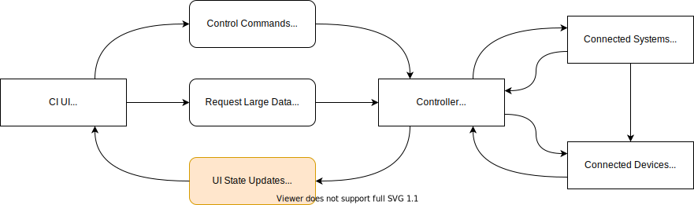

# Yuzu

UI State Updates -> UISU -> Yuzu

CI UIs are required to display the status of devices connected to the system in real time. This may be light levels, shade positions, monitoring alerts, etc.

Yuzu provides a mechanism for Hypericon Controller Gateways to push small amounts of realtime state to all connected clients.



## Quickstart

Install the library:

`npm i @hypericon/yuzu`

### Shared Definition

Create the shared initial state definition object. This specifies the type of the state objects maintained in both the client and server and provides default values.

Example:

```ts
// shared/ui-state.ts

export interface ShadeStatus {
  id: string,
  statusName: string,
  position: number,
  alerts: string[],
}
export interface FixtureStatus {
  id: string,
  brightness: number,
  alerts: string[],
}

/** UI state object used to initialise both client and server */
export const INITIAL_UI_STATE = {
  shades: new BehaviorSubject<ShadeStatus[]>([]);
  fixtures: new BehaviorSubject<FixtureStatus[]>([]);
} as const;

/** Optional UI state keys for easy refactoring. */
export const UI_STATE = {
  shades: "shades",
  fixtures: "fixtures",
} as const;
```

### Server Implementation

Implement the UI state server. An existing HTTP server must be provided.

Example:

```ts
// server/ui-state/ui-state.service.ts

import { ServerUiState } from "@hypericon/yuzu";
import { Server } from "http";
import { INITIAL_UI_STATE, UI_STATE, ShadeStatus } from "../../ui-state";

export class UiStateService {

  private uiState: ServerUiState;

  constructor(server: Server) {
    this.uiState = new ServerUiState(INITIAL_UI_STATE, { httpServer: server });

    // Example random position every 1,000 ms
    setTimeout(() => {
      const status: ShadeStatus = {
        id: "shadeID",
        statusName: "moving",
        position: Math.round(Math.random() * 100),
        alerts: [],
      };
      this.updateShadeStatus("shadeID", status);
    }, 1000);
  }

  // State could be updated by listening to other parts of the application,
  // or receiving method calls from other parts of the application.

  updateShadeStatus(id: string, status: ShadeStatus) {
    const shades = uiState.get(UI_STATE.shades);
    const shade = shades.find(s => s.id === id);
    if (shade) {
      Object.assign(shade, status);
    } else {
      shades.push(status);
    }
    uiState.update(UI_STATE.shades, shades);
  }
}
```

### Client Implementation

Implement the UI state client. The instance of the cliet UI state class should be a singleton. This is not strictly necessary, but more instances will increase network traffic for no gain.

Example Mithril page component:

```ts
// client/pages/ExampleStatePage.ts

import { ClientUiState } from "@hypericon/yuzu";
import m from "mithril";
import { Subscription } from "rxjs";
import { UI_STATE, INITIAL_UI_STATE } from "../../ui-state";

// Client UI state singleton reference
const state = new ClientUiState(INITIAL_UI_STATE);

// Example Mithril page component
export const ExampleStatePage: m.Component<{}, {
  sub: Subscription,
}> = {

  oninit() {
    this.sub = new Subscription();

    // Listen to changes on a state key
    this.sub.add(state.listen("shades", (shades) => console.log("shades updated")));

    // Listen to changes on ALL state keys
    this.sub.add(state.listenAll((key, value) => {
      console.log(`State key "${key}" updated, redrawing...`);
      m.redraw();
    }));
  },

  onremove() {
    // Clean up listeners when they are finished with
    this.sub.unsubscribe();
  },

  view() {
    return m("", [
      m("h1", "UI State Example Page"),

      // Read state using key strings
      m("h2", "Shade Status:"),
      state.get("shades").map(s => {
        const alertMsg = s.alerts.length > 0 ? s.alerts.join(", ") : "no alerts";
        return m("p", `Shade ${s.id}: ${s.statusName} @${s.position}% (${alertMsg})`);
      }),

      // (Optional) Read state using state keys object
      m("p" `Fixture ABC123 alerts: ${state.get(UI_STATE.fixtures)
                                           .filter(f => f.id === "abc123")
                                           .map(f => `${f.alerts}`)}`),
    ]);
  }

};
```

## Development

```sh
git clone https://github.com/hypcn/yuzu
cd yuzu
npm i
npm run dev
```

This starts a hot-reloading example of both client and server usage, and opens the client in the default browser.
